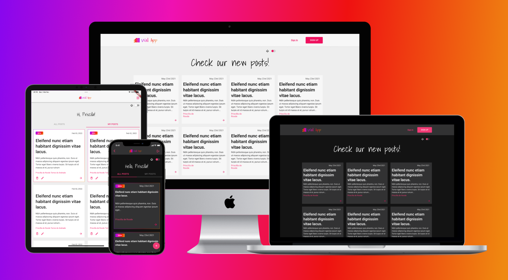
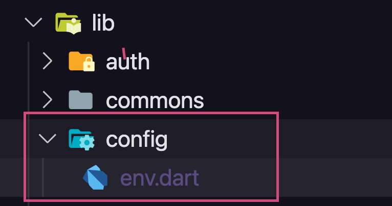
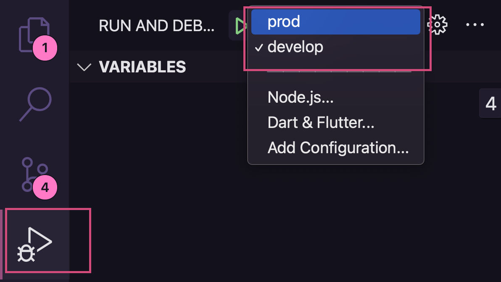

<h1 align="center">
  
</h1>

<h1 align="center">
  
</h1>

## 🚀 Project

Wall App is an application that allows users to register, log in and write to a wall, delete and edit their posts.

This project works on Web, Android and IOS devices.

## 💡 Theme mode

- Light and dark mode.

## 🖌 Design

The design was created with `Figma`. You can check it out accessing this link: [Wall App UI](https://www.figma.com/file/3KkNzVFjt8ckKLsjzgbtRB/Wall-App-UI?node-id=119%3A3608)

## 💻 Tecnologies

- Flutter 2.8.1

## :warning: Prerequisites

- To run the project you must have flutter installed correctly on your machine, if you don't already have it, [follow this intructions](https://docs.flutter.dev/get-started/install);

- Ensure [Wall App backend](https://github.com/priscilladeroode/wall_app_node) is running.

## 🚦 How to execute

- Clone this repository to your machine;
- Open the project in the IDE of your choice (I recommend VSCode);
- Inside the `lib` folder, create another folder called `config` and inside it, create the `env.dart` file like this:

<h1 align="center">
  
</h1>

- In the `env.dart` file add the following code replacing `<your-endpoint>` for the production endpoint you will use.

```dart
class EnvConfig {
  static const devAndroid = "http://10.0.2.2:5050/api";
  static const dev = "http://localhost:5050/api";
  static const prod = "<your-endpoint>";
}
```

- Open the terminal in the project root;
- To install the dependencies run

  `flutter pub get`

- If you want to run in development environment

  `flutter run -t lib/main_dev.dart`

- If you want to run in production environment

  `flutter -t lib/main.dart`

## 🐞 Debug mode (VSCode)

- To run in debug mode, add a folder called `.vscode`
- Inside it create a file called `launch.json` and paste the following code:

```
{
  "version": "0.2.0",
  "configurations": [
    {
      "name": "prod",
      "program": "lib/main.dart",
      "request": "launch",
      "type": "dart"
    },
    {
      "name": "develop",
      "program": "lib/main_dev.dart",
      "request": "launch",
      "type": "dart"
    }
  ]
}
```

- Then go to the <b>Run and Debug </b> tab, choose the environment and run the project;

<h1 align="center">
  
</h1>
